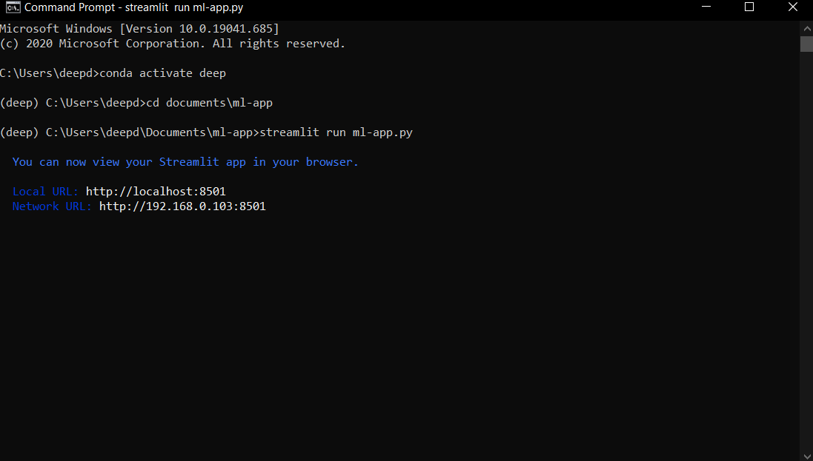
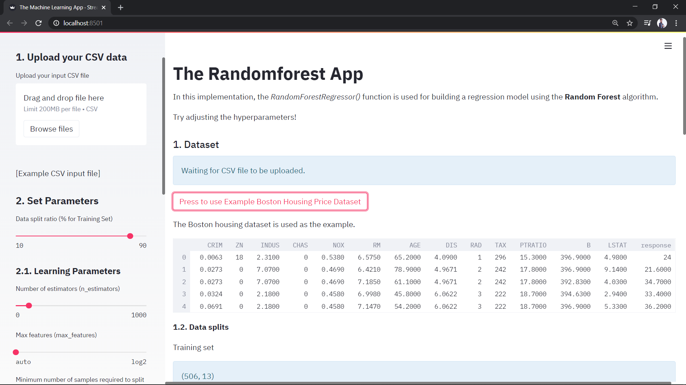

# ml-webapp
This repository contains implementation of web application using concepts of machine learning using Streamlit.It can used by uploading new data in csv format.

Note that: The target columns must be in last column as it is implemented using this thought.

Run from your command prompt in this way,

## What is Streamlit?
Streamlit offers a easy implementation of creating web application in a very fast and convinient way. Use
$ pip install streamlit

For further query, check the documentations using the following site.
https://docs.streamlit.io/en/stable/

The application will look like following:

